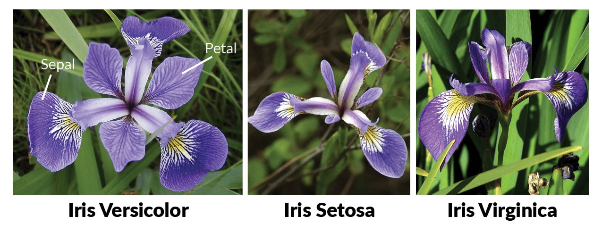

In this exam, you will demonstrate your mastery of CSCI 285 concepts in three parts. Part #1 focuses on analyzing a dataset with pandas. Part #2 focuses on visualizing it. Part #3 asks you to take the dataset and perform KMeans clustering and PCA.

* Create a notebook in Kaggle to record your answers to the exam.
* Please label each **Part** of the exam using markdown headers. 

 

# Part 1 - Pandas

The [iris flower dataset](https://www.kaggle.com/datasets/arshid/iris-flower-dataset) is a multivariate data set introduced by the British statistician and biologist Ronald Fisher in his 1936 paper "The use of multiple measurements in taxonomic problems". It is sometimes called Anderson's Iris data set because Edgar Anderson collected the data to quantify the morphologic variation of Iris flowers of three related species. The data set consists of 50 samples from each of three species of Iris (Iris Setosa, Iris virginica, and Iris versicolor). Four features were measured from each sample: the length and the width of the sepals and petals, in centimeters.

To earn a **Partially Complete** on the exam, you must 

1. Load [iris.csv](../data/iris.csv) into a pandas data frame. Record the shape of the data frame. 

2. Display the first 10 rows of the dataset.

3. Display the data types of the columns.

To earn a **Complete** on the exam, you must also 

4. Display the count of each value in the `species` column. 

5. Determine the number of irises where sepal width is greater than 3 cm. 

 

# Part 2 - Visualization

 

Next, use plotnine to visualize the dataset.

To earn a **Partially Complete** on the exam, you must 

1. Draw a box plot of species vs iris petal width (cm). Make sure that your axes are labeled and that you set a title. What differences do you notice in this plot? 

To earn a **Complete** on the exam, you must also 

3. Draw a scatter plot that includes linear regressions of two features that appear linearly related. Color by species. Make sure that your axes are labeled and that you set a title. What conclusions can you draw from this plot?

 

# Part 3 - Clustering and PCA

 

Continuing clustering with the iris flower data set.

To earn a **Partially Complete** on the exam, you must 

1. Scale your features.
2. Use KMeans to cluster your data into 3 clusters.

To earn a **Complete** on the exam, you must also 

3. Use PCA to decompose your features into two dimensions.
4. Draw a scatter plot for your two PCA dimensions and color the plot using the clustering results.
5. Discuss the results from creating this chart. 

 

# What To Turn In

A Jupyter notebook that begins with the following statement, 

> All of the below work is my own. I adhered to the test-taking procedure by not receiving any help from my peers or generative AI. I have cited all resources I found online or from notebooks shared from class that helped me complete this exam.

 