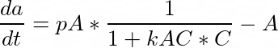
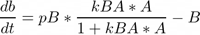
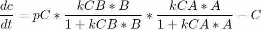

## Description

These questions can be attempted to recover points on exam 2. It is still the case that these questions should be solved individually. You can ask me as many questions as you want.

## Modeling Genetic Regulatory Networks

In biology and genetics, many researchers are trying to understand how the individual
parts of a cell function as a
[system](http://en.wikipedia.org/wiki/Systems_biology).
One type of these systems is know as
[Genetic Regulatory Networks](http://en.wikipedia.org/wiki/Gene_regulatory_network).
These networks attempt to capture the mechanisms of cell regulation over time.
Individual genes can be
[upregulated or downregulated](http://en.wikipedia.org/wiki/Downregulation_and_upregulation) by other genes active in the cell, flipping
on or off like light switches or thermostats. These changes in
regulation are how the body
reacts to different stimulus. For example, some genes are upregulated in the presence
of sunlight while others are downregulated. As day and night progress, these creates the
sleep cycle and
[circadian rhythm](http://en.wikipedia.org/wiki/Circadian_rhythm) for the organism.

Researchers
attempt to model the mechanisms they observe using differential equations.
We can specify the genetic components of a network, and then add differential
equations that capture the positive and negative feedback mechanisms we observe, according
to the [Michaelis-Menten kinetics](http://en.wikipedia.org/wiki/Michaelis%E2%80%93Menten_kinetics).

We assume each gene is both produced and degraded at each time step.
To keep things simple, we assume all of the gene is completely degraded after each unit
of time.

### Step 1

Write a function to implement the following set
of differential equations.

### Step 2

Assume an initial concentration of 0 for all three genes, with the following values for the constants

* pA = 2
* pB = 2
* pC = 5
* kAC = 1
* kBA = 1
* kCA = 1
* kCB = 100

Use Runga-Kutta 4 to simulate the change in this system over time for 10 timesteps, using an appropriately small dt.

Draw a figure showing the concentrations of each gene over time.

How long does it take to reach a steady state?

### Step 3

Rerun the simulation of your function above, but assume an initial concentration of 1 for all three genes.

Draw a figure of the change in this system over time for 10 timesteps, using an appropriately small dt.

What differences do you notice?

### Step 4

The production constants above can be parameterized to allow for outside influence on
the network. In our case, we will assume the production of A can be controlled by
light, and set up an experiment when the lights are toggled every three hours, starting with
the lights on.

Modify your code from above so that `pA` is 2 when the lights are on, and 0 when the lights are off.

Discuss how this changes the behavior of your model.

## SIR Agents

We will be recreating the SIR model of infection spread using an agent-based model.

### Step 5

Create an agent class called Person which will wander the world. This agent has one property, their state, which is given as a parameter in the initialization method.

In their step method, they should randomly wander around the world.

If an agent in the `SUSCEPTIBLE` state is at the same location as an `INFECTED` agent, then this agent will change its state to `INFECTED`.

If an agent is in the `INFECTED` state, then it will
recover after 10 timesteps and change to the `RECOVERED` state.

### Step 6

Set up the model to have height of 50 and width of 50.

Add to your model 99 Person agents, starting in random locations, with the state `SUSCEPTIBLE`.

Add to your model 1 Person agent, starting in a random location, with the state `INFECTED`.

Visualize your Persons using the server, using a circle to portray the agents on the screen. The `SUSCEPTIBLE` agents should be blue, the `INFECTED` agents should be red, and the `RECOVERED` agents should be green.

### Step 7

Set up your agent and model clases in a Jupyter notebook, and run your simulation until there are no more `INFECTED` Persons. Use a DataCollector to record the number of agents in the world that in each state at every timestep. Plot this data using ggplot and a line graph. You will want to melt your dataframe to plot all three on the same graph. What can you say about your results? How does this ABM relate to the previous differential equation SIR model?

### Step 8

Convert the recovery time for `INFECTED` agents into a parameter. This will require changes to the model, and to the server for this to be a `UserSettableParameter`. Rerun your experiment and plots for Step 7 with values of 5 and 20. Compare and contrast these new plots.

## Handin and Grading

Schedule an individual meeting with me to talk through your solutions to these questions and earn back credit.


