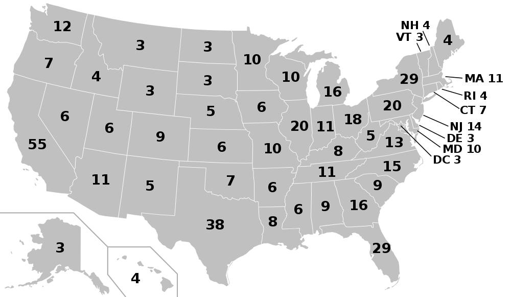

## Description

In this exam, you will demonstrate your knowledge of modeling and simulation
techniques as applied to a variety of situations.

This is a take-home,
individual exam. You may use your notes, the class webpage, and other
resources on the web with appropriate citation.
You may ask me clarifying questions, but you should refrain from discussing
the exam with your classmates, so that each person's individual knowledge and
progress is reflected in their exam submission.

## Neurons

{: .pull-right .w-50 .img-fluid}

One piece of [computational neuroscience](https://en.wikipedia.org/wiki/Computational_neuroscience) involves the simulation of individual neurons.
Mathematical models with differential equations can be written to capture the
flow of chemicals across neurons and emulate the spiking and bursting behavior
over time.

One of the more straight-forward [biological neuron models](https://en.wikipedia.org/wiki/Biological_neuron_model) is the [Hindmarsh-Rose](https://en.wikipedia.org/wiki/Hindmarsh%E2%80%93Rose_model). Three variables, `x`, `y`,
and `z` capture pieces of the membrane and ion channels, with `y` showing the
spiking of the neuron activation over time.

### Step 1

Write a function to implement the Hindmarsh-Rose neuron model so that it can be
simulated using the Runga-Kutta 4 method we implemented in class. Use the equations
and recommended parameters from the Wikipedia page linked above for `a`, `b`, `c`, `d`, `r`, `s`, and `x_R`.

### Step 2

Run a simulation of your function for 2000 timesteps, using a `dt` of 0.01, and let `I` equal 2.
Plot the trajectory of the `y` variable over time, and discuss what you observe.

### Step 3

Run a simulation of your function for 2000 timesteps, using a `dt` of 0.01, and let `I` equal 1.
Plot the trajectory of the `y` variable over time, and discuss what you observe.

### Step 4

Run a simulation of your function for 2000 timesteps, using a `dt` of 0.01, and let `I` alternate between 1 and 2 every 400 timesteps.
Plot the trajectory of the `y` variable over time, and discuss what you observe.

## Electoral College

{: .pull-right .w-50 .img-fluid}

The United States uses the [Electoral College](https://en.wikipedia.org/wiki/United_States_Electoral_College) to determine the winner of presidential elections.
Each state, plus the District of Columbia, has a designated number of electors, with the total number of electors being 538. The electors from each state are awarded to the candidate who wins the most votes in that state's election, all of which conclude voting this year on November 3rd, 2020. A candidate must earn 270 electoral college votes to win the election.

In previous years, the votes were counted and the winner of the
election was determined late in the evening on Election Day. However, this has not always been the case, as seen in the [2000 Bush vs Gore](https://en.wikipedia.org/wiki/Bush_v._Gore) election, when it took until a Supreme Court decision in December to bring the election to a close. This year's circumstances already demonstrate that anything can happen, and with a surge in absentee ballots, and new procedures to increase ballot access, and current lawsuits about these new procedures, it could take days or weeks to tally all of the votes.

To get a sense of the will of the electorate, and predict what news we might wake up to on November 4th, organizations (such as [Hendrix](https://www.hendrix.edu/news/news.aspx?id=86521) here in Arkansas)
conduct polls where they ask randomly selected likely voters for their choice in the upcoming election.
These organizations then use statistics to show how their sample of the population is representative of the whole state. Others such as [FiveThirtyEight](https://fivethirtyeight.com/) can then attempt to determine the winner of the presidential election using these polls and performing Monte Carlo simulations.

### Step 5

Download the zip file of the [polling data](https://projects.fivethirtyeight.com/2020-election-forecast/) collected by FiveThirtyEight, located at the bottom of this page, with the relevant polls recorded in `president_polls.csv`. This file holds all the presidential polls for each state from the last two years. Load this file up in a Jupyter notebook as a Pandas DataFrame.

Download a separate file containing the [electoral votes](https://raw.githubusercontent.com/chris-taylor/USElection/master/data/electoral-college-votes.csv) for each state.



### Step 6

Our goal is to predict the probability that Joe Biden, the Democratic candidate for President, will win the Electoral College vote.

For our *first assumption*, we will only use the most recent poll for each state. Format the `created_at` column of the polling DataFrame as a date_time,
and then select only the poll with the latest value for each `state` listed in the electoral votes DataFrame.

In these polls, we will need the data in the `sample_size`, `answer`, and `pct` columns. The `sample_size` is how many people were surveyed in this poll, the `answer` lists the possible choices offered, and the `pct` is the percent of
people who selected this choice. Divide the value in `pct` by 100, so it is a number between 0 and 1.

These choices don't always add up to 100%, some
small percentage of voters remain undecided or unwilling to offer their choice, and there are small margins for Libertarian, Green, and other party candidates.
For our *second assumption*, to help determine the plurality winner for each state, we will say that people are either voting for Joe Biden, or voting against him for Donald Trump, the Republican candidate. Therefore, we can select only those rows with the `answer` equal to `Biden`. If there are multiple surveys entered in the table with the same exact `created_at` time, select the one that appears first.

### Step 7

Polls based on a sample of the whole population include a *margin of error*. To determine if Biden will win a particular state, we will generate a random number using a normal distribution, with a mean of Biden's `pct` for that state's poll.
To account for the margin of error, we will use the following formula to calculate the standard deviation for the poll, which is based on the `sample_size` for that state.

1 / (2 * math.sqrt(sample_size))

### Step 8

We now have enough data to simulate the election. You should record the total number of electoral college votes for Biden across all states. For each state, generate a percentage of voters choosing Biden as stated above. If this generated value is greater than 0.5, then award those electoral college votes to Biden.

Run the election simulation 40,000 times, and collect the number of electoral votes
cast for Biden from each simulation. Plot these values using a histogram, including a vertical line at 270 electoral votes, to visually show that those simulations falling to the right of the line indicate a victory for Biden.



Clearly state the predicted probability of Biden winning the Electoral College vote in the 2020 presidential election.

How closely do your results match the predictions at FiveThirtyEight?
What could explain any differences you see? What other assumptions did we implicity make in our simulation?

## Fireflies

{: .pull-right .w-50 .img-fluid}

Certain species of
[fireflies](https://www.nps.gov/grsm/learn/nature/fireflies.htm) have been observed to synchronize their flashing. Models in science have been developed to
[understand this phenomenon](http://users.uoa.gr/~pjioannou/nonlin/fireflysychronization.pdf). You will create an agent-based model to understand these fireflies.

### Step 9

Create a Firefly that has a flash clock cycle that lasts 10 timesteps. The firefly should track where it is in their clock, and will start the simulation at a random time in the clock. For the first step of the clock, the firefly will be flashing, and the rest of the clock the firefly will be dark.

A firefly will adjust its place in its clock based on the fireflies in its neighborhood. For this model, use the Moore neighborhood. Each timestep, a firefly will look for flashing fireflies in its neighborhood. If any local fireflies are flashing, the firefly will attempt to sync with them by reseting its clock to be immediately after it would have flashed. If there are no fireflies flashing locally, the clock advances one step along the cycle.



A firefly will wander around the world, randomly choosing a new location from its neighbors.

### Step 10

Create a 30x30 model with 200 firefly agents, which as the length of the cycle and the flashing length as parameters. For your visualization in the server, make dark fireflies Brown, and lit fireflies Yellow.

### Step 11

Set up your agent and model clases in a Jupyter notebook, and run your simulation for 500 timesteps. Use a DataCollector to record the number of fireflies in the world that are lit at every timestep. Plot this data using ggplot and a line graph. What can you say about your results?

### Step 12

Alter your simulation so that each firefly flashes for the first **two** steps of the clock instead of only the first step. Rerun your simulation for 500 timesteps, plot the results, and compare to your earlier conclusions.

## Handin and Grading

Turn in your Jupyter Notebooks on Moodle in the Exam 2 folder.


