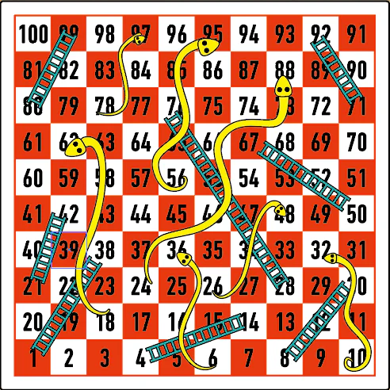

In this exam, you will demonstrate your mastery of CSCI 285 concepts in two parts. Part #1 focuses on solving a system dynamics problem. Part #2 involves a Monte Carlo simulation.

* Create a notebook in Kaggle to record your answers to the exam.
* Please label each **Part** of the exam using markdown headers. 
* Use markdown blocks to discuss your results where appropriate and cite your sources.

# Part 1

{: .pull-right .w-50 .img-fluid}

One piece of [computational neuroscience](https://en.wikipedia.org/wiki/Computational_neuroscience) involves the simulation of individual neurons.
Mathematical models with differential equations can be written to capture the
flow of chemicals across neurons and emulate the spiking and bursting behavior
over time.

One of the more straight-forward [biological neuron models](https://en.wikipedia.org/wiki/Biological_neuron_model) is the [Hindmarsh-Rose](https://en.wikipedia.org/wiki/Hindmarsh%E2%80%93Rose_model). Three variables, `x`, `y`,
and `z` capture pieces of the membrane and ion channels, with `x` showing the
spiking of the neuron activation over time.

Using `odeint`, you will solve and visualize the Hindmarsh-Rose model for x(t), y(t), and z(t).

To earn a **Partially Complete** on the exam, you must 

1. Write a function to calculate the derivative of x, y, and z at a given point in time. Use the equations as shown on the Wikipedia page. 

2. Use `odeint` and your function above to solve the model given the following:

    * For the parameters, use a = 1, b = 3, c = 1, d = 5, s = 4, x_r = -8/5, r = 0.001, I = 2. 
    * For the initial conditions, x_0 = -1.0, y_0 = 1.0, and z_0 = 2.0. 
    * For the time range, you should choose n=2000 (2000 steps) to start. 

3. Display the trajectory of the `x` variable over time, using a line graph in plotnine. Make sure that you set a title for this chart.

To earn a **Complete** on the exam, you must also 

4. Use `odeint` and your function above to solve the model, but **let `I` alternate between 1 and 2 every 400 timesteps**. 

5. Plot the trajectory of the `x` variable over time, and discuss what you observe.

# Part 2 

{: .pull-right .w-50 .img-fluid}

[Snakes and Ladders](https://en.wikipedia.org/wiki/Snakes_and_ladders) is a classic board game with ancient and mystical origin from India. you will attempt to estimate how long it takes a player on average to finish the game.

For our purposes, we will use the following setup and rules. The board consists of 100 sequentially numbered squares in a 10x10 grid. Players start the game by placing a pawn off the board (in space 0). On their turn, a player rolls a six-sided die (known as a d6) and moves that many spaces along the track. So if you roll a 3, you move 3 spaces ahead. When you reach or exceed 100 on the track, you have finished the game.

The twist is that some spaces are linked through one-way connections to others, either moving you far behind (Snakes) or far ahead (Ladders). These connections must be followed. When you land on a square with the head of a snake, you must travel backward on the board to the tail square. When you land on a square with the base of a ladder, you must travel foward to the top of the ladder.

To earn a **Partially Complete** on the exam, you must 

1. Write code to simulate one player's pathway through Snakes and Ladders and determine the number of turns taken to finish the game. 

    * Use the board image above to determine the Snake and Ladder connections. 
    * The player starts at space 0 and moves according to the rules above. 
    * The game is over after the player reaches or exceeds the 100 space, or if the game has taken longer than 1000 turns (in case they get stuck in a loop; this will happen extremely rarely but you should still account for it in your code).

2. Run the above simulation 1000 times, collecting the number of turns from each simulated game, and calculate the mean value.

3. Draw a histogram of the data collected from the 1000 simulations, with the number of turns on the x axis. Also draw a vertical line indicating the mean.

To earn a **Complete** on the exam, you must also 

4. Compare the results above with a version of the game where players move by rolling **two three-sided die** and summing the values rolled.

5. If you were given a choice of using a single six-sided die or summing two three-sided die, which would you choose and why?

# What To Turn In

A Jupyter notebook that begins with the following statement, 

> All of the below work is my own. I adhered to the test-taking procedure by not receiving any help from my peers or generative AI. I have cited all resources I found online or from notebooks shared from class that helped me complete this exam.