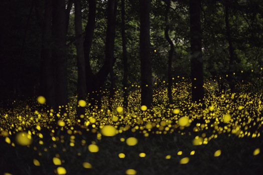

In this exam, you will demonstrate your mastery of Agent-based modeling concepts.

 

# Fireflies (75 points)

{: .pull-right .w-50 .img-fluid}

Certain species of [fireflies](https://www.nps.gov/grsm/learn/nature/fireflies.htm) have been observed to synchronize their flashing. Models in science have been developed to [understand this phenomenon](http://users.uoa.gr/~pjioannou/nonlin/fireflysychronization.pdf). You will create an agent-based model to understand these fireflies.



### Step 1: Agent

Create a Firefly that has a flash clock cycle that lasts 10 timesteps. The firefly should track where it is in their clock, and will start the simulation at a random time in the clock. For the first step of the clock, the firefly will be flashing, and the rest of the clock the firefly will be dark.



A firefly will adjust its place in its clock based on the fireflies in its neighborhood. For this model, use the [Moore neighborhood](https://mesa.readthedocs.io/en/latest/apis/space.html#mesa.space.Grid.get_neighborhood). Each timestep, a firefly will look for flashing fireflies in its neighborhood. If any local fireflies are flashing, the firefly will attempt to sync with them by reseting its clock to be immediately after it would have flashed. If there are no fireflies flashing locally, the clock advances one step along the cycle.



A firefly will wander around the world, randomly choosing a new location from its neighbors.

### Step 2: Model

Create a 30x30 model of firefly agents. The density of the agents, the length of the clock cycle, and the length of the flashing should all be parmeters. For your visualization in the server, make DARK fireflies Brown, and FLASHING fireflies Yellow. Run the simulation for 500 timestamps. For initial parameters, set density=20%, cycle_length=10, and flashing_length=1. Discuss your results.

* [server.py](../assets/code/server.py)

### Step 3: Variable Parameters

Alter your simulation so that each firefly flashes for the first **two** steps of the clock instead of only the first step. Rerun your simulation for 500 timesteps and discuss the results.

Vary other parameters, such as density and clock cycle. Discuss how this affects the firefly simulation. 

# What To Turn In

* Add the following statement in a README file in your project root directory,

> All of the below work is my own. I adhered to the test-taking procedure by not receiving any help from my peers. I have cited all resources I found online or from notebooks shared from class that helped me complete this exam.

* Please print (sign) your name and date. 

* Answer all discussion questions in the README.

* Turn in a zip file that contains your solution, any notebooks, your README, etc. 

# Grading

The first thing I plan to do when I download your zip file is to run your simulation and visualize it. Please make sure I can do that easily w/o any runtime errors.

* **Complete** - Earn (at least) 90% of the points.

* **Partially Complete** - Earn (at least) 70% of the points. 
