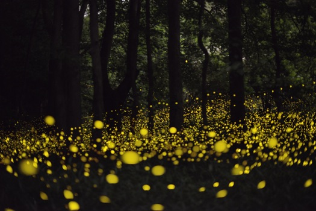

## Overview

In this lab, you will use [Mesa](https://github.com/projectmesa/mesa) to update and implement Agent-Based Models related to forest fires, chemical diffusion, ant pheromone communication, and termite construction.

## Step 1 - Forest Regrowth

Start by making a copy of the [Forest Fire Notebook](https://www.kaggle.com/code/markgoadrich/forest-fires-mesa-abm-2-4) in a new Kaggle Notebook. 

### Add Complexity

Add a new state to the tree called `Empty`, and make it the default condition for new Trees. 

Add a new parameter to the model called `lifetime` which denotes how long a tree will live in the model. Each tree when initialized to `Fine` should be given an age between 0 and `lifetime`.

Revise the model setup so that an `Empty` Tree is added to every space. Use the `density` parameter to initialize some Trees to `Fine`.

Continue the current assumption that all Trees with `x == 0` should start `On Fire` but change the ending condition of the model step method to be based on if `self.schedule.time` is greater than 200.

### Change Tree Lifecycle

Now, revise the Tree lifecycle in the step method to incorporate the following:

* `Burned Out` trees decay over time. Add a `decay_time` integer parameter to the model. Each tree that is burned should keep track of the time since it was burned. After the `decay_time` has passed, the tree decays, and its condition should be `Empty`.

* `Fine` trees can grow new `Fine` trees in adjacent `Empty` neighbors. When a tree reaches the age of the `lifetime` parameter, the tree will try to change up to two adjacent `Empty` spaces into `Fine` trees, and set their age to 0. Then, the tree will change its own condition to `Empty`.

### Analysis

Using [Forest Fire Notebook](https://nbviewer.org/github/Hendrix-CS/csci285/blob/master/assets/notebooks/Forest%20Fire%20Model.ipynb) for reference, create a notebook to re-run model simulations and perform a parameter sweep over `decay_time` from 0 to 60 with a step size of 2. Run each parameter choice 4 times. Set the other parameters, such as density and lifetime, to the interesting values you determined through visualizing your model.

 Determine the effect of changing this parameter on the number of `Fine` trees after 200 time steps.

## Step 2 - Forest Fire Visualization

Download the code for this project as a [PyCharm project](https://github.com/mgoadric/forestfires/archive/refs/heads/main.zip).

Copy the edits you made to the `TreeCell` and `ForestFire` classes into the PyCharm version of the Forest Fire project.

Visualize your results using `mesa runserver` or `python run.py`. 

Add sliders for `decay_time` and `lifetime`. 

Identify a set of parameters and/or initial conditions that create an interesting visualization that highlights all of the model's behavior. 

Take some screen shots of your visualization to turn in with your report. 

## Step 3 - Ant Parameter Tweaking

[Ant Phereomone Model](https://github.com/mgoadric/ants-mesa/archive/refs/heads/master.zip) demonstrates ants communicating about food stores using pheromone diffusion. Download this model and visualize it using `mesa runserver` or `python run.py`. Read through the README to understand the model parameters and agent rules.

You should notice that the parameters for this model are very inadequate for effective communication. Find a reasonable set of parameters that allow the ants to quickly find the food and gather it all to their home. 

Use the Notebook included in the model to visualize a graph of the food collection using your optimized parameters.

## Step 4 - Firefly Synchronization

{: .pull-right .w-50 .img-fluid}

Certain species of [fireflies](https://www.nps.gov/grsm/learn/nature/fireflies.htm) have been observed to synchronize their flashing. Models in science have been developed to [understand this phenomenon](http://users.uoa.gr/~pjioannou/nonlin/fireflysychronization.pdf). You will create an agent-based model to understand these fireflies.

 

### Step 4.1: Agent

Create a Firefly that has a flash clock cycle that lasts 10 timesteps. The firefly should track where it is in their clock, and will start the simulation at a random time in the clock. For the first step of the clock, the firefly will be flashing, and the rest of the clock the firefly will be dark.



 

A firefly will adjust its place in its clock based on the fireflies in its neighborhood. For this model, use the [Moore neighborhood](https://mesa.readthedocs.io/en/latest/apis/space.html#mesa.space.Grid.get_neighborhood). Each timestep, a firefly will look for flashing fireflies in its neighborhood. If any local fireflies are flashing, the firefly will attempt to sync with them by reseting its clock to be immediately after it would have flashed. If there are no fireflies flashing locally, the clock advances one step along the cycle.



 

A firefly will wander around the world, randomly choosing a new location from its neighbors.

 

### Step 4.2: Model

Create a 30x30 model of firefly agents. The density of the agents, the length of the clock cycle, and the length of the flashing should all be parmeters. For your visualization in the server, make DARK fireflies Brown, and FLASHING fireflies Yellow. Run the simulation for 500 timestamps. For initial parameters, set density=20%, cycle_length=10, and flashing_length=1. Discuss your results.

 

### Step 4.3: Variable Parameters

Alter your simulation so that each firefly flashes for the first **two** steps of the clock instead of only the first step. Rerun your simulation for 500 timesteps and discuss the results. Vary other parameters, such as density and clock cycle. Discuss how this affects the firefly simulation. 

