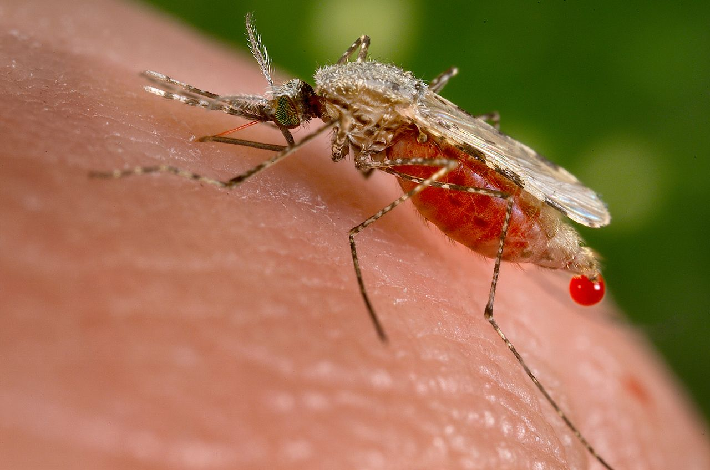

## Description

{: .pull-right .w-50 .img-fluid}

The most deadly strain of malaria is caused by [Plasmodia falciparum](https://www.ncbi.nlm.nih.gov/books/NBK555962/),
which is transmitted by
[Anopheles](https://www.who.int/westernpacific/news/q-a-detail/do-all-mosquitoes-transmit-malaria) mosquitoes. In Africa, malaria killed
close to 400,000 people in 2016.

In this lab, we will model the lifecycle of the malaria parasite and its relationship with humans and
mosquitoes using the tools of system dynamics. Our model will become
increasingly complex as we add environmental changes and treatment options.



### Step 1

Research the life cycle of malaria using the
[CDC Malaria website](https://www.cdc.gov/malaria/about/biology/index.html) as a primary resource.

Write a summary of your findings, making particular note of
the time involved in each life cycle event.

### Step 2

Based on your research above, draw an SIR
[compartment model](https://en.wikipedia.org/wiki/Compartmental_models_in_epidemiology) to describe the flow
of the human population from susceptible to infected to recovered.

Draw another SIR compartment model describing the flow of the
mosquito population.

Describe the relationship between your two population models.

### Step 3

Investigate the
[WHO malaria fact sheet for Rwanda](https://www.who.int/malaria/publications/country-profiles/profile_rwa_en.pdf?ua=1),
the [President's Malaria Initiative fact sheet](https://www.pmi.gov/docs/default-source/default-document-library/country-profiles/rwanda_profile.pdf?sfvrsn=26), and the ["In Rwanda, ‘Human Bait’ Volunteers Help Battle Malaria"](https://undark.org/2020/04/22/rwanda-malaria/) article to determine
your model parameters and initial populations.
Also research the number of mosquitoes that live in an acre and
estimate their population.

### Step 4

Use the [Runga Kutta 4](https://en.wikipedia.org/wiki/Runge%E2%80%93Kutta_methods) method described in class to
simulate the spread of malaria in Rwanda over the
next 60 months, starting in October 2020.

Draw charts showing how the populations of mosquitoes and humans
change over time, with a line for each of the individual
compartments you drew above in Step 2.

Describe the results of your simulation. Do they fit
your expectations? Why or why not? What simplifications do you
think are the major factors in any differences with reality.

### Step 5

Mosquitoes thrive in wet and rainy environments.
[Climate change will have a significant impact](https://www.expertafrica.com/rwanda/weather-and-climate) on
diseases like malaria.

Incorporate
the following [climate data](https://www.expertafrica.com/rwanda/weather-and-climate) for Rwanda into your model's mosquito population
using the ideas from an article in the journal
[Parasites and Vectors](https://parasitesandvectors.biomedcentral.com/articles/10.1186/s13071-018-3158-0).

Rerun you simulation, draw
a chart, and describe the differences you find.

### Step 6

Antimalarial drugs such as [Hydroxychloroquine](https://www.cdc.gov/malaria/resources/pdf/fsp/drugs/Hydroxychloroquine.pdf?fbclid=IwAR1lVp5ucnLK9g_crh1lro-BHlgFiqXT7sOP30lNVtTLvWCxZT5dcbB4MuM) can be effective in the
prevention of humans contracting malaria.

Research the
[efficacy](https://www.who.int/docs/default-source/documents/publications/gmp/who-cds-gmp-2019-17-eng.pdf?ua=1) of these
medications in Rwanda and update your model, factoring in a 75%
adoption rate of these medicines by the general population.

Rerun you simulation, draw
a chart, and describe the differences you find.

### Step 7

Recently, [genetically-engineered mosquitoes](https://www.nih.gov/news-events/nih-research-matters/engineering-malaria-resistance-mosquitoes)
have been developed in an attempt to inhibit the spread of malaria.

Research the effectiveness of releasing
these mosquitoes into the environment.

Incorporate your findings into your model,
assuming they will be released in Rwanda in April 2022.

Rerun you simulation, draw
a chart, and describe the differences you find.

## Evaluation

Write a summary of your modeling results and the process your
team used to create your simulations. How sensitive is your
model to the assumptions you made in finding population numbers
and rates of change? What do you think is the largest
problem with your model? How else would you
augment the model going forward?

## Grading

* 15 points for documenting your research, diagraming the lifecycle
using SIR compartment models, and setting up your initial model.
* 15 points for augmenting your model with each of the three
extensions.
* 10 points for well-written explanation of data provenance,
discussion of each graph, and summary.
